### Demo audio

#### Models trained on the Looperman dataset

#### Drum Loops

* Real

    

        <audio src="demo_page/ProjectedGAN/Drum/Real/2.wav" controls="" preload=""></audio>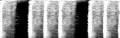
    

    

        <audio src="demo_page/ProjectedGAN/Drum/Real/152.wav" controls="" preload=""></audio>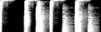
    

    

        <audio src="demo_page/ProjectedGAN/Drum/Real/277.wav" controls="" preload=""></audio>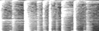
    

    

        <audio src="demo_page/ProjectedGAN/Drum/Real/371.wav" controls="" preload=""></audio>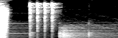
    

    

        <audio src="demo_page/ProjectedGAN/Drum/Real/497.wav" controls="" preload=""></audio>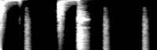
    

    

        <audio src="demo_page/ProjectedGAN/Drum/Real/501.wav" controls="" preload=""></audio>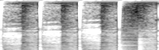
    

* StyleGAN2

    

        <audio src="demo_page/ProjectedGAN/Drum/StyleGAN2/2.wav" controls="" preload=""></audio>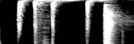
    

    

        <audio src="demo_page/ProjectedGAN/Drum/StyleGAN2/249.wav" controls="" preload=""></audio>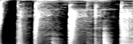
    

    

        <audio src="demo_page/ProjectedGAN/Drum/StyleGAN2/596.wav" controls="" preload=""></audio>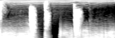
    

    

        <audio src="demo_page/ProjectedGAN/Drum/StyleGAN2/1001.wav" controls="" preload=""></audio>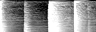
    

    

        <audio src="demo_page/ProjectedGAN/Drum/StyleGAN2/1226.wav" controls="" preload=""></audio>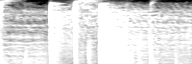
    

    

        <audio src="demo_page/ProjectedGAN/Drum/StyleGAN2/1505.wav" controls="" preload=""></audio>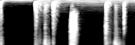
    

* ProjectedStyleGAN2 (VGG)

    

        <audio src="demo_page/ProjectedGAN/Drum/VGG/5.wav" controls="" preload=""></audio>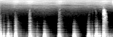
    

    

        <audio src="demo_page/ProjectedGAN/Drum/VGG/1005.wav" controls="" preload=""></audio>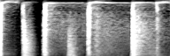
    

    

        <audio src="demo_page/ProjectedGAN/Drum/VGG/1413.wav" controls="" preload=""></audio>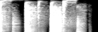
    

    

        <audio src="demo_page/ProjectedGAN/Drum/VGG/1500.wav" controls="" preload=""></audio>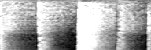
    

    

        <audio src="demo_page/ProjectedGAN/Drum/VGG/2501.wav" controls="" preload=""></audio>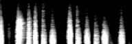
    

    

        <audio src="demo_page/ProjectedGAN/Drum/VGG/3506.wav" controls="" preload=""></audio>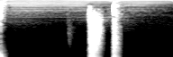
    

* ProjectedStyleGAN2 (SCNN on Loop)

    

        <audio src="demo_page/ProjectedGAN/Drum/SCNN/0.wav" controls="" preload=""></audio>
    

    

        <audio src="demo_page/ProjectedGAN/Drum/SCNN/1.wav" controls="" preload=""></audio>
    

    

        <audio src="demo_page/ProjectedGAN/Drum/SCNN/2.wav" controls="" preload=""></audio>
    

    

        <audio src="demo_page/ProjectedGAN/Drum/SCNN/3.wav" controls="" preload=""></audio>
    

    

        <audio src="demo_page/ProjectedGAN/Drum/SCNN/4.wav" controls="" preload=""></audio>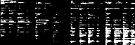
    

    

        <audio src="demo_page/ProjectedGAN/Drum/SCNN/5.wav" controls="" preload=""></audio>
    

* ProjectedStyleGAN2 (Fusion)

    

        <audio src="demo_page/ProjectedGAN/Drum/Fusion/1006.wav" controls="" preload=""></audio>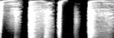
    

    

        <audio src="demo_page/ProjectedGAN/Drum/Fusion/1597.wav" controls="" preload=""></audio>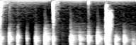
    

    

        <audio src="demo_page/ProjectedGAN/Drum/Fusion/3997.wav" controls="" preload=""></audio>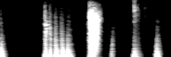
    

    

        <audio src="demo_page/ProjectedGAN/Drum/Fusion/4507.wav" controls="" preload=""></audio>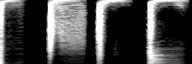
    

    

        <audio src="demo_page/ProjectedGAN/Drum/Fusion/5502.wav" controls="" preload=""></audio>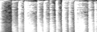
    

    

        <audio src="demo_page/ProjectedGAN/Drum/Fusion/5851.wav" controls="" preload=""></audio>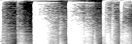
    

#### Synth Loops

* StyleGAN2

    

        <audio src="demo_page/ProjectedGAN/B/0.wav" controls="" preload=""></audio>
    

    

        <audio src="demo_page/ProjectedGAN/B/6.wav" controls="" preload=""></audio>
    

    

        <audio src="demo_page/ProjectedGAN/B/249.wav" controls="" preload=""></audio>
    

    

        <audio src="demo_page/ProjectedGAN/B/1353.wav" controls="" preload=""></audio>
    

    

        <audio src="demo_page/ProjectedGAN/B/1002.wav" controls="" preload=""></audio>
    

    

        <audio src="demo_page/ProjectedGAN/B/460.wav" controls="" preload=""></audio>
    

* ProjectedStyleGAN2 (VGG)

    

        <audio src="demo_page/ProjectedGAN/C/1.wav" controls="" preload=""></audio>
    

    

        <audio src="demo_page/ProjectedGAN/C/8.wav" controls="" preload=""></audio>
    

    

        <audio src="demo_page/ProjectedGAN/C/126.wav" controls="" preload=""></audio>
    

    

        <audio src="demo_page/ProjectedGAN/C/253.wav" controls="" preload=""></audio>
    

    

        <audio src="demo_page/ProjectedGAN/C/454.wav" controls="" preload=""></audio>
    

    

        <audio src="demo_page/ProjectedGAN/C/1498.wav" controls="" preload=""></audio>
    

* ProjectedStyleGAN2 (SCNN on Loop)

    

        <audio src="demo_page/ProjectedGAN/D/1.wav" controls="" preload=""></audio>
    

    

        <audio src="demo_page/ProjectedGAN/D/2.wav" controls="" preload=""></audio>
    

    

        <audio src="demo_page/ProjectedGAN/D/245.wav" controls="" preload=""></audio>
    

    

        <audio src="demo_page/ProjectedGAN/D/5324.wav" controls="" preload=""></audio>
    

    

        <audio src="demo_page/ProjectedGAN/D/1999.wav" controls="" preload=""></audio>
    

    

        <audio src="demo_page/ProjectedGAN/D/4504.wav" controls="" preload=""></audio>
    

* ProjectedStyleGAN2 (Fusion)

    

        <audio src="demo_page/ProjectedGAN/D/1.wav" controls="" preload=""></audio>
    

    

        <audio src="demo_page/ProjectedGAN/D/2.wav" controls="" preload=""></audio>
    

    

        <audio src="demo_page/ProjectedGAN/D/245.wav" controls="" preload=""></audio>
    

    

        <audio src="demo_page/ProjectedGAN/D/5324.wav" controls="" preload=""></audio>
    

    

        <audio src="demo_page/ProjectedGAN/D/1999.wav" controls="" preload=""></audio>
    

    

        <audio src="demo_page/ProjectedGAN/D/4504.wav" controls="" preload=""></audio>
    

