### Demo audio

#### Models trained on the Looperman dataset

* StyleGAN

still training ......

* StyleGAN2

    

        <audio src="demo_page/loooperman/stylegan2_synth/wav/0.wav" controls="" preload=""></audio>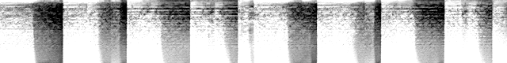
    

    

        <audio src="demo_page/loooperman/stylegan2_synth/wav/381.wav" controls="" preload=""></audio>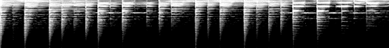
    

    

        <audio src="demo_page/loooperman/stylegan2_synth/wav/496.wav" controls="" preload=""></audio>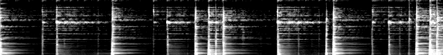
    

    

        <audio src="demo_page/loooperman/stylegan2_synth/wav/995.wav" controls="" preload=""></audio>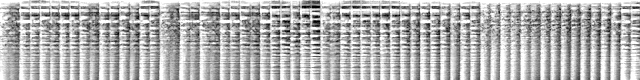
    

    

        <audio src="demo_page/loooperman/stylegan2_synth/wav/1493.wav" controls="" preload=""></audio>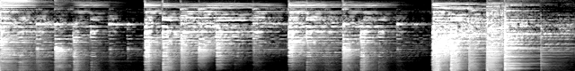
    

    

        <audio src="demo_page/loooperman/stylegan2_synth/wav/1498.wav" controls="" preload=""></audio>
    

* StyleGAN2 - weight demodulation 

    

        <audio src="demo_page/loooperman/stylegan2_A_synth/wav/1.wav" controls="" preload=""></audio>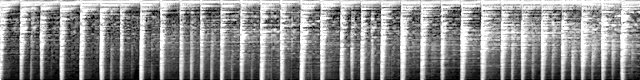
    

    

        <audio src="demo_page/loooperman/stylegan2_A_synth/wav/52.wav" controls="" preload=""></audio>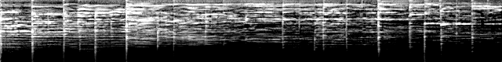
    

    

        <audio src="demo_page/loooperman/stylegan2_A_synth/wav/397.wav" controls="" preload=""></audio>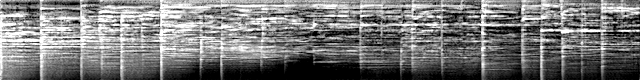
    

    

        <audio src="demo_page/loooperman/stylegan2_A_synth/wav/497.wav" controls="" preload=""></audio>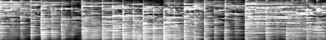
    

    

        <audio src="demo_page/loooperman/stylegan2_A_synth/wav/901.wav" controls="" preload=""></audio>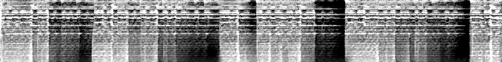
    

    

        <audio src="demo_page/loooperman/stylegan2_A_synth/wav/1503.wav" controls="" preload=""></audio>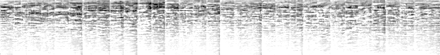
    

* StyleGAN2 - path length regularization

    

        <audio src="demo_page/loooperman/stylegan2_B_synth/wav/5.wav" controls="" preload=""></audio>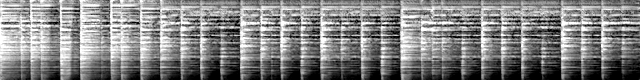
    

    

        <audio src="demo_page/loooperman/stylegan2_B_synth/wav/461.wav" controls="" preload=""></audio>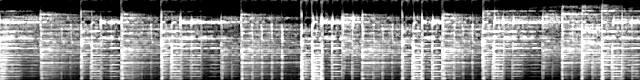
    

    

        <audio src="demo_page/loooperman/stylegan2_B_synth/wav/501.wav" controls="" preload=""></audio>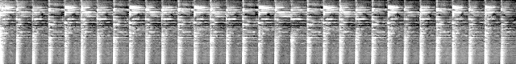
    

    

        <audio src="demo_page/loooperman/stylegan2_B_synth/wav/651.wav" controls="" preload=""></audio>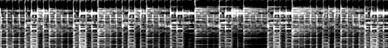
    

    

        <audio src="demo_page/loooperman/stylegan2_B_synth/wav/997.wav" controls="" preload=""></audio>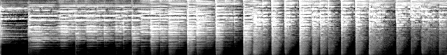
    

    

        <audio src="demo_page/loooperman/stylegan2_B_synth/wav/1283.wav" controls="" preload=""></audio>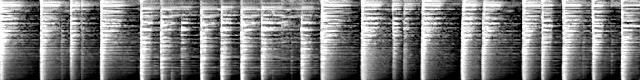
    

* StyleGAN2 - no progressive growing

running.......

