### Demo audio

#### Models trained on the Looperman dataset

##### Drum Loops

* StyleGAN2

    

        <audio src="demo_page/ProjectedGAN/B/0.wav" controls="" preload=""></audio>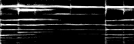
    

    

        <audio src="demo_page/ProjectedGAN/B/6.wav" controls="" preload=""></audio>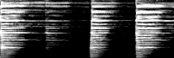
    

    

        <audio src="demo_page/ProjectedGAN/B/249.wav" controls="" preload=""></audio>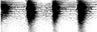
    

    

        <audio src="demo_page/ProjectedGAN/B/1353.wav" controls="" preload=""></audio>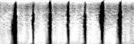
    

    

        <audio src="demo_page/ProjectedGAN/B/1002.wav" controls="" preload=""></audio>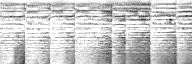
    

    

        <audio src="demo_page/ProjectedGAN/B/460.wav" controls="" preload=""></audio>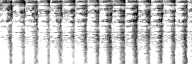
    

* ProjectedStyleGAN2 (VGG)

    

        <audio src="demo_page/ProjectedGAN/C/1.wav" controls="" preload=""></audio>
    

    

        <audio src="demo_page/ProjectedGAN/C/8.wav" controls="" preload=""></audio>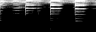
    

    

        <audio src="demo_page/ProjectedGAN/C/126.wav" controls="" preload=""></audio>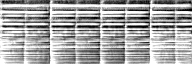
    

    

        <audio src="demo_page/ProjectedGAN/C/253.wav" controls="" preload=""></audio>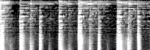
    

    

        <audio src="demo_page/ProjectedGAN/C/454.wav" controls="" preload=""></audio>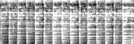
    

    

        <audio src="demo_page/ProjectedGAN/C/1498.wav" controls="" preload=""></audio>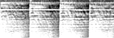
    

* ProjectedStyleGAN2 (SCNN on Loop)

    

        <audio src="demo_page/ProjectedGAN/D/1.wav" controls="" preload=""></audio>
    

    

        <audio src="demo_page/ProjectedGAN/D/2.wav" controls="" preload=""></audio>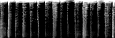
    

    

        <audio src="demo_page/ProjectedGAN/D/245.wav" controls="" preload=""></audio>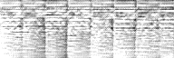
    

    

        <audio src="demo_page/ProjectedGAN/D/5324.wav" controls="" preload=""></audio>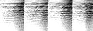
    

    

        <audio src="demo_page/ProjectedGAN/D/1999.wav" controls="" preload=""></audio>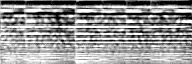
    

    

        <audio src="demo_page/ProjectedGAN/D/4504.wav" controls="" preload=""></audio>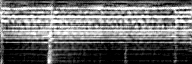
    

* ProjectedStyleGAN2 (Fusion)

    

        <audio src="demo_page/ProjectedGAN/D/1.wav" controls="" preload=""></audio>
    

    

        <audio src="demo_page/ProjectedGAN/D/2.wav" controls="" preload=""></audio>
    

    

        <audio src="demo_page/ProjectedGAN/D/245.wav" controls="" preload=""></audio>
    

    

        <audio src="demo_page/ProjectedGAN/D/5324.wav" controls="" preload=""></audio>
    

    

        <audio src="demo_page/ProjectedGAN/D/1999.wav" controls="" preload=""></audio>
    

    

        <audio src="demo_page/ProjectedGAN/D/4504.wav" controls="" preload=""></audio>
    

##### Synth Loops

* StyleGAN2

    

        <audio src="demo_page/ProjectedGAN/B/0.wav" controls="" preload=""></audio>
    

    

        <audio src="demo_page/ProjectedGAN/B/6.wav" controls="" preload=""></audio>
    

    

        <audio src="demo_page/ProjectedGAN/B/249.wav" controls="" preload=""></audio>
    

    

        <audio src="demo_page/ProjectedGAN/B/1353.wav" controls="" preload=""></audio>
    

    

        <audio src="demo_page/ProjectedGAN/B/1002.wav" controls="" preload=""></audio>
    

    

        <audio src="demo_page/ProjectedGAN/B/460.wav" controls="" preload=""></audio>
    

* ProjectedStyleGAN2 (VGG)

    

        <audio src="demo_page/ProjectedGAN/C/1.wav" controls="" preload=""></audio>
    

    

        <audio src="demo_page/ProjectedGAN/C/8.wav" controls="" preload=""></audio>
    

    

        <audio src="demo_page/ProjectedGAN/C/126.wav" controls="" preload=""></audio>
    

    

        <audio src="demo_page/ProjectedGAN/C/253.wav" controls="" preload=""></audio>
    

    

        <audio src="demo_page/ProjectedGAN/C/454.wav" controls="" preload=""></audio>
    

    

        <audio src="demo_page/ProjectedGAN/C/1498.wav" controls="" preload=""></audio>
    

* ProjectedStyleGAN2 (SCNN on Loop)

    

        <audio src="demo_page/ProjectedGAN/D/1.wav" controls="" preload=""></audio>
    

    

        <audio src="demo_page/ProjectedGAN/D/2.wav" controls="" preload=""></audio>
    

    

        <audio src="demo_page/ProjectedGAN/D/245.wav" controls="" preload=""></audio>
    

    

        <audio src="demo_page/ProjectedGAN/D/5324.wav" controls="" preload=""></audio>
    

    

        <audio src="demo_page/ProjectedGAN/D/1999.wav" controls="" preload=""></audio>
    

    

        <audio src="demo_page/ProjectedGAN/D/4504.wav" controls="" preload=""></audio>
    

* ProjectedStyleGAN2 (Fusion)

    

        <audio src="demo_page/ProjectedGAN/D/1.wav" controls="" preload=""></audio>
    

    

        <audio src="demo_page/ProjectedGAN/D/2.wav" controls="" preload=""></audio>
    

    

        <audio src="demo_page/ProjectedGAN/D/245.wav" controls="" preload=""></audio>
    

    

        <audio src="demo_page/ProjectedGAN/D/5324.wav" controls="" preload=""></audio>
    

    

        <audio src="demo_page/ProjectedGAN/D/1999.wav" controls="" preload=""></audio>
    

    

        <audio src="demo_page/ProjectedGAN/D/4504.wav" controls="" preload=""></audio>
    

